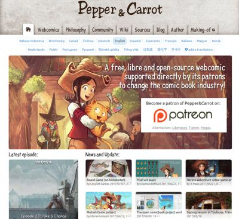

# Pepper&Carrot full website

**Note:**

- Login: **admin**
- Password: **password**

## Description



This repository is the full website of the open-source webcomic [http://www.peppercarrot.com](http://www.peppercarrot.com). It is powered by a [PluXml](http://www.pluxml.org/) open-source ([GNU GPL V3](http://www.gnu.org/copyleft/gpl.html)) content management system and a couple of plugin. The theme was built around the default PluXML theme and use two big libraries: [Parsedown](http://parsedown.org/) lib-parsedown.php ([MIT License](https://opensource.org/licenses/MIT)) and PluCSS released by the PLuXML team under the same license than PLuXml, GPLv3. The website uses also a couple of PluXML plugins ( for the plugins full information read **plugins/<nameoftheplugin>/info.xml** files).

**So is it just a theme and a open-source project?**

**Yes and no.** I had to do [little tweaks](https://www.peppercarrot.com/data/images/lab/2015-02-21_Multilingue-SVG-researches/2015-02-21_11_cleaning-code.jpg) here and there to mix multilang, translated webcomic, support of thumbnails, reuse of the database of the blog on the pages, etc...etc... The main fork I made were ported on the three plugins: **plxMyMultiLingue** (to display the webcomic multilang and remove the multilang for the blog pages while keeping it for the static pages) **Vignette** (for managing all the pictures resize on the website but also many little functions as previous and next buttons) and **plxEditor** (for colored syntax highlight, and snippet of code to include pictures in WYSWYG mode with a 'click to enlarge' ready feature).

The "core" folder is almost untouched pure PluXml by design; to allow easier upgrade.

The theme use a lot of template for the static pages: **static-contribute.php**, **static-fanart-gallery.php**, **static-sources.php**, **static-wiki.php** ... allow me to directly inject PHP in the website pages while getting the benefit of header, footer, and translation system. The content string of text is almost all contained in the theme : **/themes/peppercarrot-theme_v2/lang** . This system was at the origin a design from the PLuXml team to add little keyword and allow the translation of the theme, but I found this system interesting and abused it for the full translation system of the static page.

Finally, all the database was too big to be hosted here (20GB) so I created a fake database with colored image proxy colored and fake episodes. You can find them on 0_sources and data/images mainly. This strategy reduced the full Git website repo to 20MB. You'll see, it's "colored". ;-)

## For translator, How-to:

The file to translate the Pepper&Carrot website are all in **/themes/peppercarrot-theme_v2/lang** of this repository.


To translate just duplicate the en.php file and rename it to your country code (according the [table here](http://www.w3schools.com/tags/ref_language_codes.asp)). Then edit it with a text-editor.

1. For a typical line like this one:

``` 'FOLLOW'        =>  'Follow Pepper&amp;Carrot on :', ```

2. The first part ``` 'FOLLOW' ```  is the unique ID, do not translate it.

3. The arrow ``` => ``` links the previous field with the next one (note, you can add any amount of spacebar characters between the fields (eg. if you want to align all ``` => ``` in your file)).

4. Last field is ```'Follow Pepper&amp;Carrot on :'``` use HTML encapsuled inside ```'``` symbols. It's the content to translate. If you need a special character like the one ```&```, use the charset ```&amp;```, and if you need to use ```'```, you'll need to escape it with a backslash ```\'``` . Except that, the website is encoded in UTF8, so pretty tolerant to all euro-latino-accents, and other unicode compatible languages.

5. Last character in the line is ```,``` and mean the line is over.

## Install

### Preparing repo

The website will not run as it is after a fresh clone. You'll need a temporary cache folder and a database of blog post, comments, artworks, comics, etc... This repository comes with it, but you need to copy the folders manually. In the git repository, do:
```
cp -r .0_sources 0_sources
cp -r .data data
cp -r .tmp tmp
cp .gitignore.template .gitignore
cp .htaccess.template .htaccess
# Note: You might need to adjust .htaccess Rewrite base, more information in the comment of .htaccess.template
chown -R www-data tmp
touch 0_sources/last_updated.txt
chown www-data 0_sources/last_updated.txt
# Note: You might change user www-data to the user who runs apache
```
This will allow you to create your own datas and password without the file in this folders being tracked by git and pushed to the repository ( **0_sources**, **data** and **tmp** are all ".gitignored" ). You can also host other folders in this directory and customize **.gitignore** to not push them.

### Hosting

Hosting this website needs PHP, GD image library, XML support for PHP, URL rewrite, ZIP. The database is made of flat-file, no MySQL. For a local install on a Ubuntu machine, I usually do it this way:

```
sudo apt install apache2 
echo "ServerName localhost" | sudo tee /etc/apache2/conf-available/fqdn.conf
sudo a2enconf fqdn
sudo a2enmod rewrite
sudo apt install php libapache2-mod-php php-gd php-xml php-mbstring
sudo systemctl restart apache2
sudo rm -r /var/www/html
sudo ln -s ~/peppercarrot/website /var/www/html
```
and for permissions
```
sudo gedit /etc/apache2/sites-available/000-default.conf
```
add this at the end of this file
```
<Directory "/var/www/html">
  AllowOverride All
</Directory>
```
and finish with a 
```
sudo systemctl restart apache2
```
You can use your browser now and visit http://localhost/ 

To connect to the admin visit http://localhost/core/admin/auth.php : login **admin**, password **password**.
Enjoy!

### Using docker image

A docker image can be used for testing purpose

```
docker build . -t peppercarrot-website:test
# Note: you can change 8080 to the port you wish
docker run -it --rm -p 8080:80 peppercarrot-website:test
firefox http://localhost:8080
```

## Contribution

I'm open to any type of enhancement! Better code, cleaner code identation, code comment, new features, bug fixes, update to newer version, security test, etc... You can also find a TODO.md text at the root with my various idea. Do not hesitate to open a bug report ticket to just talk about something if you are not sure. The credit for the contributors of the website will be written on the [Author](https://www.peppercarrot.com/en/static7/author) page. (edited via **AUTHORS.md** in the peppercarrot/webcomics repository).

## License

See the file LICENSE in the repository or visit [GNU GPL V3](http://www.gnu.org/copyleft/gpl.html).
